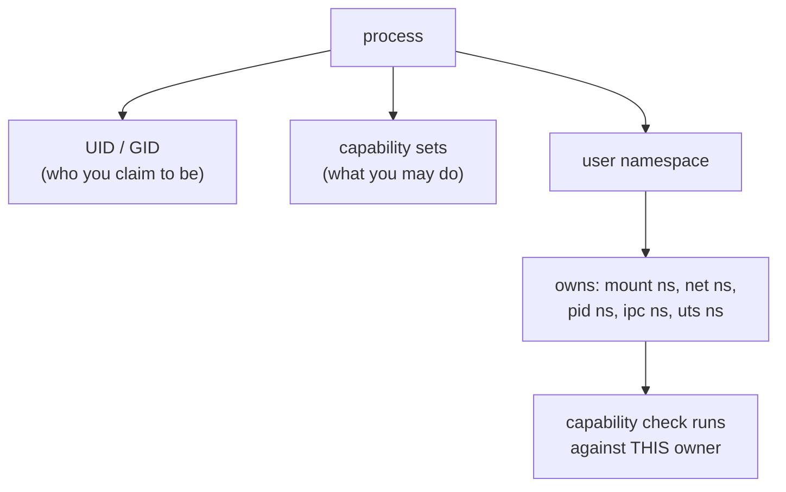
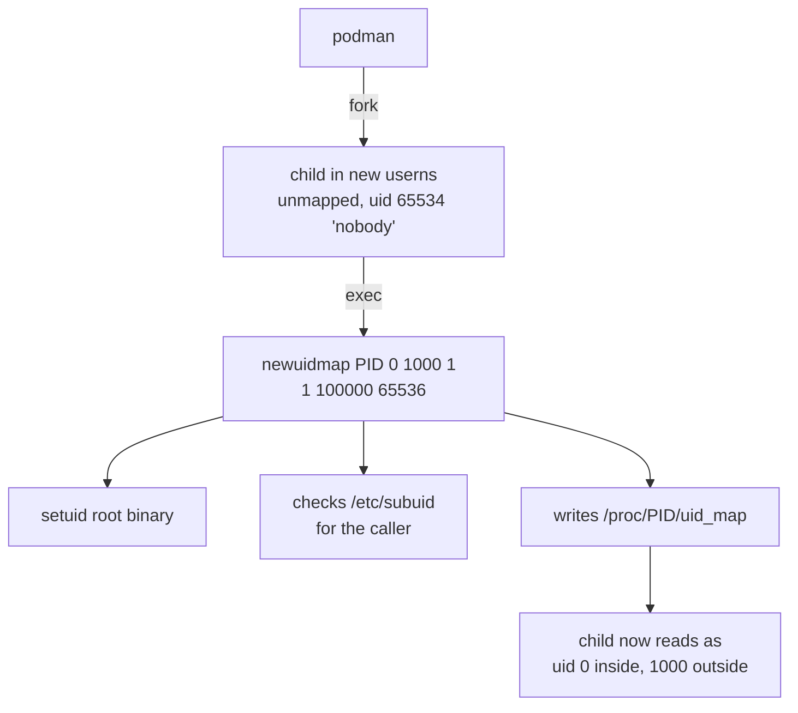

# The Reality of Rootless Containers

::label::
CONTAINERDAYS 2026 · HAMBURG

::subtitle::
What actually changes, what does not, and what it costs

::speaker::
Ajitem Sahasrabuddhe

::role::
Automattic · @asahasrabuddhe

::initials::
AS

<!--
**S01 · COVER · 0:00**

Your name, Automattic, nothing else. This sits up while the room settles. Ten
seconds once you start talking, then advance into the cold open.
-->

---
layout: default
---

<div class="h-full">
  <DemoTerminal :font-size="18" />
</div>

<!--
**COLD OPEN · 0:10**

The audience sees a terminal and nothing else. Single pane, rootless,
deliberately: splitting the claim across two panes shows two processes and
proves nothing. Click the terminal once to type.

**DO**:
```bash
./scripts/demo.sh 1
```

It starts a rootless container, prints `id` from inside it, finds the PID on the
host, prints the host's view of that same PID, then prints the container's
`uid_map`.

**SAY**, once the container's `id` and the host's `Uid:` line are both up:
> "Same process. The container says root. The host says ajitem. Both of them are
> telling the truth, and the gap between those two answers is the entire subject
> of this talk."

Then advance straight into S02, which is the payoff line. PageDown works while
the terminal is focused.

**WATCH FOR** a pull. If the image is not already local this hangs in front of
the room. `./scripts/demo.sh check` confirms it at pre-flight, so do not skip
that step. If the terminal shows a dead session, `r` restarts it.
-->

---
layout: statement
---

# Both answers are true

<!--
**S02 · STATEMENT · 1:40**

The thesis. Let it sit for two seconds before the roadmap. Do not narrate it,
the cold open already made the point. This is the slide you gesture back to
later.
-->

---
layout: default
---

# Three claims

<div class="pt-2 text-xl space-y-6">

<v-clicks>

**1.** Root is not UID 0. Root is a set of capabilities, evaluated against a namespace.

**2.** Rootless shrinks the blast radius of an escape. It does not prevent the escape.

**3.** You pay for it: in features, in throughput, and in one new attack surface.

</v-clicks>

</div>

<div v-click class="pt-10 opacity-60">
I run rootless. I also think most of what people believe about it is wrong.
</div>

<!--
**S03 · CLAIMS · 1:55**

Say the three claims as written, then land the last line out loud:

**SAY**
> "I run rootless. I also think most of what people believe about it is wrong."

That is what buys the right to be critical for the next twenty minutes without
the talk reading as a hit piece.
-->

---
layout: statement
---

# UID 0 is a shorthand

<div class="opacity-70 pt-4">
Since Linux 2.2 the kernel has not asked "is this UID 0?"
</div>

<!--
**S04 · STATEMENT · 2:30**

**SAY**: since Linux 2.2 the kernel has not asked "is this UID 0". It asks
whether the process holds the capability, evaluated against the namespace that
owns the resource.
-->

---
layout: default
---

# The credential model



<!--
**S05 · DIAGRAM · 2:55**

Walk it top to bottom, in order: UID and GID are who you claim to be, the
capability sets are what you may do, the user namespace owns the other four
namespace types, and the check runs against whoever owns the resource rather
than against a global notion of root.

The one sentence that matters: does this process hold the capability for this
operation, in the user namespace that owns the resource?
-->

---
layout: statement
---

# A user namespace is the only namespace<br/>that owns other namespaces

<div class="opacity-70 pt-6">
That ownership is how an unprivileged user configures a network<br/>
interface, mounts a filesystem, and sets a hostname.
</div>

<!--
**S06 · STATEMENT · 3:35**

**SAY**: that ownership is the entire mechanism. It is why an unprivileged user
can configure a network interface, mount a filesystem and set a hostname, all
without ever holding root on the host.
-->

---
layout: default
---

# Five moving parts

<div class="grid grid-cols-5 gap-4 pt-12 text-center">
<div class="p-4 border-l-2 b-accent">
<div class="text-3xl opacity-40">1</div>
<div class="pt-2">Identity</div>
</div>
<div class="p-4 border-l-2 border-white/20">
<div class="text-3xl opacity-40">2</div>
<div class="pt-2 opacity-50">Filesystem</div>
</div>
<div class="p-4 border-l-2 border-white/20">
<div class="text-3xl opacity-40">3</div>
<div class="pt-2 opacity-50">cgroups</div>
</div>
<div class="p-4 border-l-2 border-white/20">
<div class="text-3xl opacity-40">4</div>
<div class="pt-2 opacity-50">Network</div>
</div>
<div class="p-4 border-l-2 border-white/20">
<div class="text-3xl opacity-40">5</div>
<div class="pt-2 opacity-50">Execution</div>
</div>
</div>

<!--
**S08 · PROGRESS · 4:55**

Name all five once. This slide comes back four more times with the highlight
moved, so you never re-explain it, you glance at it as you land on each section.
Costs nothing, and the room always knows where it is.
-->

---
layout: default
---

# 1. Identity: two boring files

```console
$ cat /etc/subuid
ajitem:100000:65536

$ cat /etc/subgid
ajitem:100000:65536
```

<div v-click class="pt-8 opacity-80">
The administrator has delegated 65,536 UIDs, starting at 100000, to me.<br/>
I may map them however I like inside a namespace I create.
</div>

<!--
**S09 · IDENTITY · 5:20**

**SAY**: the administrator delegated 65,536 UIDs, starting at 100000, to me. I
may map them however I like inside a namespace I create.

Nothing to type here. The live version is Demo A.
-->

---
layout: default
---

# The map has two lines

```console
/ # cat /proc/self/uid_map
         0       1000          1
         1     100000      65536
```

<v-clicks>

<div class="pt-6">

**Container UID 0 is your own host UID.** Not the start of the range.

</div>

<div>

A file written by "root" inside a rootless container lands on disk owned by you. A file written by UID 1000 inside lands on disk owned by 100999.

</div>

</v-clicks>

<!--
**S10 · IDENTITY · 5:50**

**SAY**, then pause:
> "Container UID 0 is your own host UID. Not the start of the delegated range."

Then: a file written as root inside a rootless container lands on disk owned by
you. This surprises almost everybody, including people who run rootless
containers daily. Pause here and let it land.
-->

---
layout: default
---

# Who writes that map?



<!--
**S11 · DIAGRAM · 6:35**

Walk it. Podman forks a child into an unmapped namespace, then execs the setuid
helper `newuidmap`, which checks `/etc/subuid` for the caller and writes
`/proc/<pid>/uid_map` on its behalf.
-->

---
layout: statement
class: warn
---

# Two setuid-root binaries<br/>sit in your trust path

<div class="opacity-70 pt-6 text-white">
"Rootless" describes the runtime, not the installation.
</div>

<!--
**S12 · WARN · 7:05**

**SAY**: `newuidmap` and `newgidmap`, from shadow-utils. Small, well reviewed,
and root. They have had bugs: CVE-2018-7169 in `newgidmap` before shadow 4.6.
Rootless describes the runtime, not the installation.

First uncomfortable truth. There are three. Do not explain the colour, just let
the tone shift.
-->

---
layout: default
---

# 2. Filesystem: three eras

| Era | Mechanism | Cost |
|---|---|---|
| Before 5.11 | `fuse-overlayfs` in userspace | Every metadata op crosses to userspace |
| Kernel 5.11+ | overlayfs inside a userns | Native speed for images |
| Kernel 5.12+ | **idmapped mounts** | Shared volumes with no recursive `chown` |

<div v-click class="pt-8 opacity-80">
Most rootless folklore you have heard dates from the first row.
</div>

<!--
**S13 · FILESYSTEM · 7:35**

**SAY**: most rootless folklore about slow builds dates from the first row,
`fuse-overlayfs`. Kernel 5.11 moved overlayfs itself inside a user namespace.
5.12 added idmapped mounts.
-->

---
layout: default
---

# Idmapped mounts

```
   ON DISK                    IN THE CONTAINER
   /srv/data                  /data
   owner: 100000       ──▶    owner: 0
                    VFS shift
   no chown. no copy. no 3GB of inode churn.
```

<div v-click class="pt-8 opacity-80">
Remember this one. It is the exact kernel feature that let user-namespaced
pods use volumes in Kubernetes, and we come back to it at the end.
</div>

<!--
**S14 · FILESYSTEM · 7:55**

**SAY**: the VFS shifts ownership on the fly. No recursive chown, no copy.

Then plant the seed deliberately:
> "Remember this one. It is the exact kernel feature that let user-namespaced
> pods use volumes in Kubernetes, and we come back to it in the last five
> minutes."

Paid back on S37.
-->

---
layout: default
---

# 3. cgroups: three outcomes

<div class="pt-6 font-mono text-sm leading-loose">
<div><span class="rootless">cgroup v2 + systemd delegation</span> &nbsp;→&nbsp; limits work</div>
<div><span class="warn">cgroup v2, no delegation</span> &nbsp;&nbsp;&nbsp;&nbsp;&nbsp;&nbsp;→&nbsp; limits silently unavailable</div>
<div><span class="rootful">cgroup v1</span> &nbsp;&nbsp;&nbsp;&nbsp;&nbsp;&nbsp;&nbsp;&nbsp;&nbsp;&nbsp;&nbsp;&nbsp;&nbsp;&nbsp;&nbsp;&nbsp;&nbsp;&nbsp;&nbsp;&nbsp;&nbsp;&nbsp;&nbsp;&nbsp;&nbsp;→&nbsp; "not supported and ignored"</div>
</div>

```console
$ systemctl show user@$(id -u).service -p Delegate
$ cat /sys/fs/cgroup/user.slice/user-1000.slice/cgroup.controllers
cpu memory pids
```

<!--
**S15 · CGROUPS · 8:25**

Read the three rows in order: v2 with delegation works, v2 without delegation is
silently unavailable, v1 is not supported and ignored. Do not explain the
mechanism yet, that is the next slide.
-->

---
layout: statement
class: rootful
---

# `--memory=512m` is not an error.<br/>It is a no-op with a warning.

<div class="opacity-70 pt-6 text-white">
A container you believed was capped is not capped.
</div>

<!--
**S16 · WARN · 8:55**

**SAY**, slowly:
> "A container you believed was capped is not capped."

Ten seconds of silence. Second uncomfortable truth, and a genuine production
hazard rather than a curiosity.
-->

---
layout: default
---

# 4. Network: nobody gave you a tap device

<div class="grid grid-cols-2 gap-8 pt-4 font-mono text-sm">
<div class="border-l-2 b-rootful pl-4">
<div class="rootful pb-2">ROOTFUL</div>
<pre>
container netns
    │ veth
    ▼
host bridge (cni0)
    │
    ▼
host netns → NIC
</pre>
</div>
<div class="border-l-2 b-rootless pl-4">
<div class="rootless pb-2">ROOTLESS</div>
<pre>
container netns
    │ tap
    ▼
pasta / slirp4netns
    │ userspace TCP/IP
    ▼
host socket → NIC
</pre>
</div>
</div>

<div v-click class="pt-6 opacity-80">
One end of a veth pair lives in the host netns. You cannot put it there.
</div>

<!--
**S17 · NETWORK · 9:20**

**SAY**: one end of a veth pair has to live in the host's network namespace, and
an unprivileged user cannot put it there. So rootless containers run a userspace
TCP/IP stack instead, `pasta` or `slirp4netns`.
-->

---
layout: default
---

# What userspace networking costs

<v-clicks>

- Packets are copied through a userspace process. Throughput and latency both suffer.
- Ports below 1024 refused, unless the admin lowers `net.ipv4.ip_unprivileged_port_start`
- `ping` works only if your GID is in `net.ipv4.ping_group_range`
- The source IP the container sees is often the gateway, not the client. Your IP allow-lists and access logs are wrong.
- Most CNI plugins assume host privileges and simply do not apply

</v-clicks>

<!--
**S18 · NETWORK · 9:55**

Run the five bullets at a clip, this is a list slide, do not dwell. The one worth
a half-beat extra: the source IP the container sees is often the gateway rather
than the real client, which silently breaks IP allow-lists and access logs.
-->

---
layout: default
---

# pasta vs slirp4netns

| | slirp4netns | pasta |
|---|---|---|
| Addressing | Invents a subnet (10.0.2.0/24) | Copies the host's addresses and routes |
| Throughput | Lower | Meaningfully better |
| Default in | Docker rootless | Podman 5.0+ |

<div v-click class="pt-8 opacity-80">
If you benchmarked rootless networking before 2024, benchmark it again.
</div>

<!--
**S19 · NETWORK · 10:20**

**SAY**: `pasta` copies the host's actual addresses and routes rather than
inventing a fake subnet, and it is meaningfully faster. If you benchmarked
rootless networking before 2024, benchmark it again.
-->

---
layout: statement
---

# Membership of the `docker` group<br/>has always been root on that host

<div class="opacity-70 pt-6">
Rootless deletes that entire category of mistake.
</div>

<!--
**S20 · STATEMENT · 10:40**

Fifteen seconds. Execution is the fifth moving part: `crun` and `runc` create the
same namespaces and apply the same seccomp profile either way. No privileged
daemon in Podman rootless. Docker rootless still has a daemon, but it is yours,
socket under `$XDG_RUNTIME_DIR`. This deletes a whole category of operational
mistake, and it is the strongest plain argument for rootless.

**CHECKPOINT** you should be at roughly 11:00. If you are past it, go straight
into Demo A.
-->

---
layout: section
class: text-center
---

# Demo A

## Podman did this in one command.<br/>What did it actually do?

<!--
**S21 · SECTION · 11:00**

**SAY**: "Podman did this in one command. What did it actually do?"

No window switch. The next three slides each carry a rootless terminal into the
`primary` VM, already in `~/crl`, and they are all the same session, so the
scrollback carries across the beats. Click a terminal once to type in it;
PageUp and PageDown still drive the deck while it has focus, and `r` restarts a
dead session. Demo A is single pane, rootless only, same as before.
-->

---
layout: default
---

# A Go program cannot unshare itself

<<< @/snippets/unshare-raw.go go

<div v-click class="pt-2 opacity-80">
<code>CLONE_NEWUSER</code> is only legal for a single-threaded process.
The Go runtime is multi-threaded before <code>main</code> starts.
So it forks and execs. Exactly what runc does.
</div>

<div class="h-36 mt-3">
  <DemoTerminal />
</div>

<!--
**S22 · CODE · 11:15**

**SAY**: `CLONE_NEWUSER` is only legal for a single-threaded process, and the Go
runtime is multi-threaded before `main` starts. A Go program can never unshare
itself into a user namespace, it has to fork and exec, which is exactly what
`runc` does.

Point at the three fields, `ContainerID: 0`, `HostID: uid`, `Size: 1`, and say:
that struct literal is the `uid_map` line from S10.

**DO**, beat 1, in the slide's terminal (click it first):
```bash
./nsdemo 1
```

Expected: `uid=65534`, an empty `uid_map`, `CapPrm` and `CapEff` all zeroes, and
a full `CapBnd`.

**SAY** once it prints:
> "Not root. Not you. Nobody. And look at the two capability sets. The bounding
> set is full and the effective set is empty. The ceiling is unlimited, the
> holding is nothing."
-->

---
layout: statement
---

# Full capability set.<br/>Held by nobody.

<div class="font-mono text-sm opacity-70 pt-6">
uid=65534 &nbsp; uid_map: (empty)<br/>
CapEff: 0000000000000000 &nbsp; CapBnd: 000001ffffffffff
</div>

<div class="h-52 mt-8 text-left">
  <DemoTerminal />
</div>

<!--
**S23 · STATEMENT · 12:15**

The kernel grants the full set at `clone`, then `execve` takes it back. An
unmapped process has euid 65534, so the exec counts as unprivileged and the
effective set arrives empty. The bounding set survives untouched, and that gap
is the slide. Let it sit two seconds, then straight down to the terminal.

**DO**, beat 2:
```bash
./nsdemo 2
```

Expected: `uid=0`, `uid_map` reads `0 <your uid> 1`, then three probe lines.

```
DENIED   append to /etc/shadow
ALLOWED  mount a tmpfs
ALLOWED  write into $HOME
```
-->

---
layout: statement
---

# `0 1000 1`

<div class="opacity-70 pt-6">
Three fields. That is the entire security model.
</div>

<div class="h-52 mt-8 text-left">
  <DemoTerminal />
</div>

<!--
**S24 · STATEMENT · 13:15**

**SAY**: three fields, and that is the entire security model made visible.

> "Root on a host file, denied. Root in my own home directory, allowed. Remember
> this, it is the audit section of the whole talk arriving eighteen minutes
> early. We come back to it on S28."

**DO**, beat 3:
```bash
./nsdemo 3
```

Expected: `cmd.Start()` fails with `operation not permitted`. The failure comes
from `Start()` rather than from inside the child, because the write to `uid_map`
happens during process creation. Widening the map beyond your own ID needs
`CAP_SETUID` in the parent namespace, which you do not have. That is why
`/etc/subuid` and the helpers from S09 exist.

**CHECKPOINT** beat 3 is the first thing to cut. Skip to beat 4 and say the line
instead of running it.

**DO**, beat 4, the best one:
```bash
./nsdemo 4
```

Expected in order: the child reports unmapped and blocked, two lines showing
`newuidmap` and `newgidmap` invoked with the exact triples, then the same PID
reporting again as `uid=0` with a two-line map.

**SAY**, exactly:
> "Same PID. No setuid call. Nothing about this process changed. The kernel
> changed its mind about who it is."

**WATCH FOR** beat 3 prints `operation not permitted` both when it is working
correctly and when the AppArmor sysctl is blocking everything, so it is the one
beat that is not a signal. Beats 1, 2 and 4 fail loudly.
-->

---
layout: statement
---

# Same PID. No setuid call.<br/>The kernel changed its mind about who it is.

<div class="opacity-70 pt-6">
A text file, a setuid helper, and a kernel that has always cared<br/>
about namespaces more than it cared about UID 0.
</div>

<!--
**S25 · STATEMENT · 15:00**

Closes Demo A. Let it sit. Do not re-explain, you already said it. This is the
visual confirmation.

**CHECKPOINT** you should be at 15:00. The budget was four minutes from 11:00.
If beat 3 was cut you are ahead, bank the time for demo 3.
-->

---
layout: section
class: text-center
---

# Demos 1 to 5

## One script. Two panes.<br/>The only difference is where I typed it.

<div class="font-mono text-sm pt-4">
<span class="rootful"># sudo -i ; ./scripts/demo.sh 3</span><br/>
<span class="rootless">$ &nbsp;&nbsp;&nbsp;&nbsp;&nbsp;&nbsp;&nbsp;&nbsp;&nbsp;&nbsp;./scripts/demo.sh 3</span>
</div>

<div class="grid grid-cols-2 gap-4 h-48 mt-6 text-left">
  <DemoTerminal root :font-size="13" />
  <DemoTerminal :font-size="13" />
</div>

<!--
**S26 · SECTION · 15:00**

The two panes are on the slide from here on. LEFT is rootful and red, RIGHT is
rootless and green, and stays that way for the rest of the talk. Click a pane
to type in it, same as the Demo A terminals.

**SAY**, pointing at the two lines:
> "Left pane, sudo, this script, argument three. Right pane, same file, same
> argument, no sudo. The only difference is which pane I typed it in."

Say it once. Do not repeat it for the later demos, the room has it now.

Demo 1 already ran in the cold open after the cover, and the right pane is the
same session, so its output is still in the scrollback. Gesture at it, or say:
> "Container 0 to host 1000 on the right, container 0 to host 0 on the left. No
> translation, no boundary."

**DO**, demo 2, LEFT first then RIGHT, back to back:
```bash
LEFT:   ./scripts/demo.sh 2
RIGHT:  ./scripts/demo.sh 2
```

Expected: `tmpfs mount: OK` on both. The block-device mount and `mknod` succeed
on the left and print `DENIED` on the right.
-->

---
layout: statement
---

# tmpfs yes. ext4 no.

<div class="opacity-70 pt-6">
<code>FS_USERNS_MOUNT</code> is a flag on the filesystem type.<br/>
The capability is genuine. The set of objects it applies to is not.
</div>

<!--
**S27 · STATEMENT · 16:30**

Confirms what demo 2 just showed.

**SAY**: tmpfs is allowed everywhere because it carries a flag saying a user
namespace may mount it. The real disk and the device node are not, even under
`--privileged` on the right. Privileged in rootless mode grants everything your
namespace holds, which still is not device access.

Two seconds, advance. Demo 3 next, and it is the money demo.
-->

---
layout: default
---

# The same mistake, two outcomes

```
-v /etc:/host   →   echo "backdoor::0:0::/root:/bin/sh" >> /host/passwd
```

<div class="grid grid-cols-2 gap-8 pt-4 font-mono">
<div class="border-l-2 b-rootful pl-4">
<div class="rootful">LEFT</div>
<div class="text-2xl pt-2">WROTE</div>
<div class="opacity-60 pt-2 text-sm">That host now has an unauthenticated root account.</div>
</div>
<div class="border-l-2 b-rootless pl-4">
<div class="rootless">RIGHT</div>
<div class="text-2xl pt-2">DENIED</div>
<div class="opacity-60 pt-2 text-sm">Container UID 0 is host UID 1000. You.</div>
</div>
</div>

<div class="grid grid-cols-2 gap-4 h-44 mt-4">
  <DemoTerminal root :font-size="13" />
  <DemoTerminal :font-size="13" />
</div>

<!--
**S28 · LIVE · 16:45**

**SAY** before running it:
> "Same mistake on both sides, a volume mount most of you have written by
> accident at some point."

**DO**:
```bash
LEFT:   ./scripts/demo.sh 3
RIGHT:  ./scripts/demo.sh 3
```

Expected, read step: LEFT prints the first line of `/etc/shadow`, RIGHT prints
`DENIED`. Write step: LEFT prints `WROTE` and the script removes the backdoor
line immediately, RIGHT prints `DENIED`.

**SAY** the moment LEFT prints `WROTE`, after one full second of silence:
> "That host now has an unauthenticated root account. One flag did it."

Then, gesturing at both outputs together:
> "The mount succeeded in both panes. Rootless did not stop the mistake. It made
> the mistake survivable."

The third step runs in the same invocation, and both panes print
`not-a-real-key` from a scratch directory you own.

**SAY**:
> "And here is the honest half. Your own data is in the blast radius either way.
> For a laptop or a CI runner, that is most of what an attacker wanted in the
> first place."

**WATCH FOR** the cleanup. This is the one command in the talk with a real
consequence if it fails. The script arms a trap, but confirm it anyway:
```bash
LEFT:   grep backdoor /etc/passwd || echo "clean"
```
-->

---
layout: statement
---

# The mount succeeded in both panes.

<div class="pt-6">
Rootless did not stop the mistake.<br/>
<span class="accent">It made the mistake survivable.</span>
</div>

<!--
**S29 · STATEMENT · 18:00**

Pause two full seconds before advancing. This is the talk in one sentence and it
is the line people quote. Add nothing, the slide and your delivery a moment ago
already did the work.
-->

---
layout: section
class: text-center
---

# Demo 4

## Ask for a limit.<br/>Then ask the container what it got.

<div class="font-mono pt-4 opacity-70">
67108864 &nbsp;=&nbsp; the limit applied<br/>
anything else &nbsp;=&nbsp; it did not
</div>

<div class="relative h-48 mt-6 text-left">
  <div v-click.hide="1" class="absolute inset-0 grid grid-cols-2 gap-4">
    <DemoTerminal root :font-size="13" />
    <DemoTerminal :font-size="13" />
  </div>
  <div v-click="1" class="absolute inset-0">
    <DemoTerminal vm="cgroupv1" :font-size="13" />
  </div>
</div>

<!--
**S30 · SECTION · 18:15**

**SAY**: "ask for a limit, then ask the container what it got."

**DO**, on `primary`:
```bash
LEFT:   ./scripts/demo.sh 4
RIGHT:  ./scripts/demo.sh 4
```

Expected on cgroup v2 with delegation: both panes read `67108864` from inside
the container, so the limit applied on both sides.

Then the second half, live on the cgroup v1 box. One click swaps the pair for a
single rootless terminal on `cgroupv1`, already connected because that VM has
been up since T-90:
```bash
RIGHT:  ./scripts/demo.sh 4
```

Expected there: RIGHT gets a warning and no working limit, LEFT is unaffected
because root does not go through the same delegation path.

**SAY**:
> "67108864 means the limit landed. Anything else means it did not, and on a
> cgroup v1 rootless host you get a warning, not an error. A container you
> believed was capped is not capped."
-->

---
layout: section
class: text-center
---

# Demo 5

## Userspace networking, and its bill

<div class="font-mono text-sm pt-4 opacity-70">
measured beforehand. never benchmark live.
</div>

<div class="h-52 mt-6 text-left">
  <DemoTerminal />
</div>

<!--
**S31 · SECTION · 19:30**

**SAY**: "userspace networking, and its bill." Then immediately:
> "The throughput numbers were measured beforehand. I am not benchmarking network
> throughput live on conference wifi, and neither should you."

**DO**, live, quick and safe, in the slide's terminal, rootless only:
```bash
RIGHT:  ./scripts/demo.sh 5
```

Expected: publishing port 80 fails on the right with a `rootlessport` error and
succeeds on the left. The script also lists which of `pasta` and
`slirp4netns` are installed, and on this box both are.

Narrate rather than reading the terminal: packets copied through a userspace
process cost throughput and latency, and ports below 1024 need a sysctl that
applies to the whole host rather than to your container.
-->

---
layout: default
---

# Measured on my hardware

<div class="numeric-table">

| iperf3 TCP | Rootful | pasta | slirp4netns |
|---|---|---|---|
| Gbit/s | 128 | 82.3 | 28.4 |
| vs veth | baseline | 36% slower | 78% slower |

</div>

<div class="pt-6 opacity-80">
Rootless cold start to echo, <span class="accent">193 ms</span>.
Cold pull and extract of a <span class="accent">927 MB</span> image.
</div>

<div class="pt-4 opacity-60 text-sm">
Ubuntu 24.04, kernel 6.8, in a VM. There is no wire, so read the ratios,
not the absolute numbers.
</div>

<!--
**S32 · NUMBERS · 21:00**

Point at the table and state the numbers from memory rather than reading cells.
`pasta` beats `slirp4netns`, and both lose to a native veth pair on throughput.

Say the caveat out loud: this was measured in a VM, so the ratios are the result
and the absolute figures are not. Method and full output are in
`docs/benchmarks.md` in the companion repo.

**CHECKPOINT** you should be at 22:00 leaving this slide. If you are past it,
skip to S34 and reduce S33 to one line: "there is a table in the deck, and the
short version is that CI runners and developer laptops are where this pays off
cleanly."
-->

---
layout: default
---

# What rootless genuinely fixes

<div class="text-xl space-y-4 pt-4">

- **`docker` group equals root.** No privileged daemon, no root-owned socket.
- **Escape to host root (CVE-2019-5736).** The runtime binary is not writable by your UID.
- **Leaked fd escapes (CVE-2024-21626).** Reachable files are ones your UID already reached.
- **Careless `-v /:/host`.** Bounded by your UID's own permissions.
- **Multi-tenant CI runners.** Each job gets a distinct UID range.

</div>

<!--
**S33 · TABLE · 22:00**

Written to be photographed. Do not read every row. Name the categories once,
`docker` group risk, known escape CVEs, careless volume mounts, multi-tenant CI,
then move on. Give the room three seconds of silence with the slide up, people
are taking photos.
-->

---
layout: default
---

# What it does not touch

<div class="text-xl space-y-3 pt-4">

- **Kernel LPE.** One shared kernel. A kernel bug is a kernel bug.
- **Your own data.** SSH keys, cloud creds, source, `~/.kube/config`.
- **Egress abuse.** Mining, exfiltration, botnets. No root needed.
- **Supply chain.** A malicious image runs as you. That is enough.
- **Denial of service.** Especially where cgroup limits are ignored.
- **Lateral movement.** Same UID range, same everything.

</div>

<!--
**S34 · TABLE · 22:45**

Same treatment, do not read every row. The one to say out loud rather than just
point at:
> "Your own data. SSH keys, cloud credentials, source code, your kubeconfig. None
> of that is protected by any of this."
-->

---
layout: statement
class: warn
---

# Rootless *adds* an attack surface

<!--
**S35 · WARN · 23:30**

Pause before this slide even appears if you can control the advance. Third
uncomfortable truth, and the one that gets quoted. Say it plainly, no hedging:

**SAY**
> "Rootless adds an attack surface."

Two full seconds. By now the room reads the colour before you speak.
-->

---
layout: default
---

# The sysctls hardening guides argue about

```console
# Debian family, the blunt instrument
$ sysctl kernel.unprivileged_userns_clone

# Ubuntu 23.10+, the surgical one
$ sysctl kernel.apparmor_restrict_unprivileged_userns
```

<v-clicks>

<div class="pt-2">

A long line of local privilege-escalation bugs (filesystem mount parsers, nf_tables, overlayfs copy-up) were reachable by unprivileged users **only because** they could enter a user namespace first.

</div>

<div class="pt-4">

Ubuntu's is an allowlist, not a switch. Podman is on it. `unshare`, and the program from Demo A, are not.

</div>

<div class="accent pt-4">

The feature that makes rootless containers possible is the one hardening guides restrict, and what you are trusting instead is a list of 91 binaries.

</div>

<div class="h-32 mt-3">
  <DemoTerminal vm="hardened" :auto-connect="false" :font-size="13" />
</div>

</v-clicks>

<!--
**S36 · SYSCTLS · 24:00**

**SAY**: a long line of local privilege-escalation bugs, in filesystem mount
parsers, `nf_tables` and overlayfs copy-up, were reachable by unprivileged users
only because they could enter a user namespace first.

Then the correction, which is yours and measured, and which calls back to Demo A.
Ubuntu's sysctl is an allowlist rather than a switch. At its shipped value of 1,
Podman still runs rootless containers, because `/etc/apparmor.d/podman` grants
`userns`, as do ninety other profiles on the image. What gets refused is
`unshare` by hand and the program from Demo A, because nobody wrote them a
profile. The room already watched that refusal without knowing what it was.

Then the line from the slide, verbatim:
> "The feature that makes rootless containers possible is the one hardening
> guides restrict, and what you are trusting instead is a list of 91 binaries."

**DO**, optional, both read-only and safe on the demo box. Both keys exist on
this Ubuntu 24.04 VM, so they return values, not errors:
```bash
sysctl kernel.unprivileged_userns_clone             # 1 on the primary VM
sysctl kernel.apparmor_restrict_unprivileged_userns # 0 on primary, 1 on hardened
```

If anyone pushes back it is five seconds on the `hardened` VM: the last click
reveals a terminal for it, click-to-start so it never dials out on its own.
Three lines, in order:
```bash
sysctl kernel.apparmor_restrict_unprivileged_userns    # reads 1
podman run --rm docker.io/library/alpine:3.20 id       # works: uid=0 inside
./nsdemo 2                                              # refused: operation not permitted
```
Podman is on the AppArmor allowlist, so its container still comes up at the
restricted value; `nsdemo` is not, so the kernel refuses it the user namespace.
That is the same refusal they watched in Demo A, so call back to it. It only
connects if the VM is up, which T-90 does not do by default:
`./qemu/vm.sh up hardened` and `make push VARIANT=hardened` beforehand, or skip
the click and say it.

No exploit code and no live demonstration of any CVE. Show the sysctls, name the
shape of the risk, stop there.
-->

---
layout: default
---

# Kubernetes finally caught up

```yaml
apiVersion: v1
kind: Pod
spec:
  hostUsers: false          # one field, open since 2016
  containers:
    - name: app
      image: ghcr.io/example/app:1.0
```

<div v-click class="pt-6 opacity-80">

GA in **v1.36**, April 2026. Alpha 1.25, beta 1.30, default 1.33.
Persistent volumes under a user namespace only became practical once idmapped mounts landed in 5.12.

</div>

<div v-click class="pt-4 opacity-60 text-sm">

Caveats: modern kernel and CRI support required, some volume and device
types restricted, each pod consumes a 65,536-UID range so pods-per-node is
capped, and the container still runs as UID 0 inside.

</div>

<!--
**S37 · KUBERNETES · 25:00**

Lead with the field, not the version. `hostUsers: false` turns on, for a whole
Pod, the same user namespace this talk has been about. Everything from the
credential model through Demo A is what runs underneath that one line. What you
ran by hand in a shell is now a declarative field.

**SAY**:
> "One field. Underneath it is every mechanism we just spent twenty minutes on."

The timeline is the evidence it is real and not a lab toy: alpha in 1.25, GA in
v1.36 this April, on KEP-127, open since 2016.

**CALLBACK** to the idmapped-mounts slide from earlier:
> "A user-namespaced pod could not use a persistent volume until the kernel
> could remap file ownership. That is the 5.12 feature from earlier, paying off
> here."

State the caveats in one breath and do not soften them: a modern kernel and CRI,
some volume and device types still restricted, a 65,536-UID range per pod so
pods-per-node is capped, and the container still runs as UID 0 inside. That
65,536 is the same range as `/etc/subuid` from the Identity section, so call
back to it if the room is with you.

**SAY**, on that last caveat, because it is the whole talk again:
> "This is not `runAsNonRoot`. The process inside is still UID 0. `hostUsers`
> gives you the boundary, not a non-root process. You want both."
-->

---
layout: default
---

# So: should you?

| Context | Verdict |
|---|---|
| CI runners, untrusted builds | **Strong yes.** The best argument rootless has. |
| Developer laptops | **Yes.** Loses almost nothing. |
| Shared multi-tenant hosts | **Yes**, with per-user subuid ranges. |
| Kubernetes workers | **Yes**, `hostUsers: false`, no longer exotic. |
| Network-heavy workloads | **Measure first.** |
| Host devices, GPUs, low ports | **Probably not.** |
| Hosts where userns is disabled | **No, and that is coherent.** |

<!--
**S38 · VERDICT · 26:00**

Do not read the whole table. Land on two rows only: CI runners are the strongest
yes, host devices and low ports are the clearest no. The rest is there for people
to photograph and read later.
-->

---
layout: default
---

# Five things to take away

<v-clicks>

**1.** Root is a capability set evaluated against a user namespace, not UID 0.

**2.** Rootless shrinks the blast radius. It does not prevent the mistake.

**3.** Your own data is inside the blast radius. On a laptop or a CI runner, that is most of what matters.

**4.** What you lose is concrete: cgroup limits on old hosts, network throughput, low ports, some devices.

**5.** Rootless needs unprivileged user namespaces, which is itself an attack surface. Know your threat model, then choose.

</v-clicks>

<div v-click class="pt-8 accent">
Not a security button. A smaller, sharper blast radius, bought with real
trade-offs. That is a good deal, as long as you know you are making it.
</div>

<!--
**S39 · TAKEAWAYS · 27:00**

Read all five, they are short. This is the slide you leave up through Q&A.

Slow down on the fifth:
> "Rootless needs unprivileged user namespaces, which is itself an attack surface.
> Know your threat model, then choose."

Then the closing line, verbatim, and stop talking immediately after:
> "Not a security button. A smaller, sharper blast radius, bought with real
> trade-offs. That is a good deal, as long as you know you are making it."

**Do not advance to the thank-you slide.** Leave this one up and take questions
against it.
-->

---
layout: end
url: github.com/asahasrabuddhe/cds-2026-hamburg-crl-slides
qr: /images/qr-slides.svg
handles:
  - label: cds-2026-hamburg-crl-code
    href: https://github.com/asahasrabuddhe/cds-2026-hamburg-crl-code
  - label: "@asahasrabuddhe"
    href: https://github.com/asahasrabuddhe
---

<!--
**S40 · END · 30:00**

You should not be on this slide during Q&A. Leave S39 up. If the deck has moved
past it, press `o` for the overview grid and click back to S39.

Q&A, in the order you are most likely to be asked:

1. **Is rootless slower?** Networking yes, and storage on old kernels. CPU-bound
   workloads are unaffected. Give the numbers from S32.
2. **Can I run Kubernetes rootless?** Two different questions. A fully rootless
   kubelet, usernetes or k3s rootless, is niche. Pods with `hostUsers: false` on
   an ordinary cluster is GA and boring, which is the good kind of answer.
3. **Does it replace gVisor, Kata, Firecracker?** No, they compose. Rootless
   narrows what an escape yields. Those change what an escape has to break
   through in the first place.
4. **We disabled unprivileged user namespaces for hardening, now what?** That is
   a coherent position, not a mistake. You have chosen rootful with tight seccomp
   and AppArmor and no `docker` group membership. Say so out loud rather than
   pretending both are simultaneously possible.
5. **Is `--privileged` safe in rootless mode?** Safer, not safe. It grants
   everything your namespace holds. Demo 2 already showed it cannot reach host
   devices, but it gives full access to everything your own UID owns.

Both repos are linked on this slide. Mention that the safety note about demo 3 is
in the companion README before anyone runs it unsupervised.
-->
