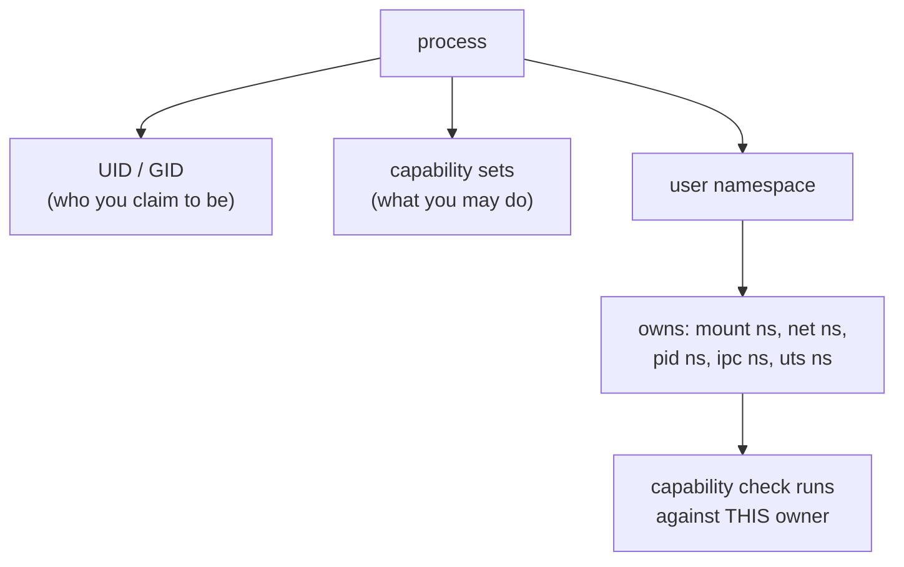
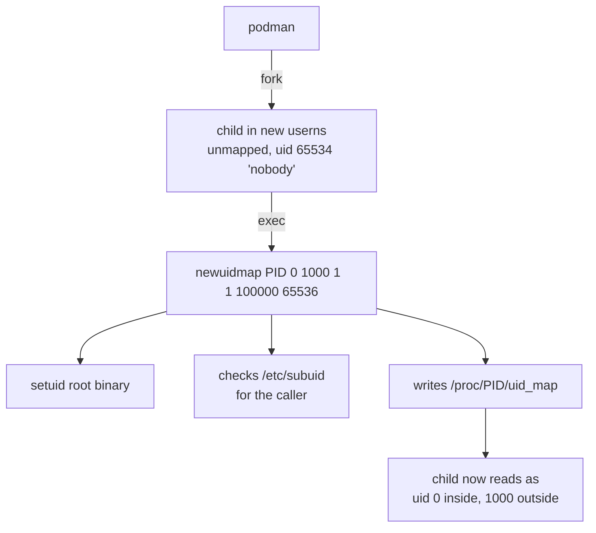

# The Reality of Rootless Containers

::label::
CONTAINERDAYS 2026 · HAMBURG

::subtitle::
What actually changes, what does not, and what it costs

::speaker::
Ajitem Sahasrabuddhe

::role::
Automattic · @asahasrabuddhe

::initials::
AS

<!--
COLD OPEN HAPPENS BEFORE THIS SLIDE. Two tmux panes, already running.
Left: podman run alpine, id says uid=0(root).
Right: ps on the host says ajitem, /proc/PID/status says Uid: 1000.

"Same process. The container says root. The host says ajitem.
 Both of them are telling the truth, and the gap between those
 two answers is the entire subject of this talk."

Ten seconds on this slide. Then move.
-->

---
layout: statement
---

# Both answers are true

<!--
This is the thesis. Let it sit for two seconds before the roadmap.
-->

---
layout: default
---

# Three claims

<v-clicks>

**1.** Root is not UID 0. Root is a set of capabilities, evaluated against a namespace.

**2.** Rootless shrinks the blast radius of an escape. It does not prevent the escape.

**3.** You pay for it: in features, in throughput, and in one new attack surface.

</v-clicks>

<div v-click class="pt-8 opacity-60">
I run rootless. I also think most of what people believe about it is wrong.
</div>

<!--
Say the last line out loud. It buys credibility for the criticism later
and stops the talk reading as a hit piece.
-->

---
layout: statement
---

# UID 0 is a shorthand

<div class="opacity-70 pt-4">
Since Linux 2.2 the kernel has not asked "is this UID 0?"
</div>

---
layout: default
---

# The credential model



<!--
The kernel asks: does this process hold the capability for this operation,
in the user namespace that owns the resource?
-->

---
layout: statement
---

# A user namespace is the only namespace<br/>that owns other namespaces

<div class="opacity-70 pt-6">
That ownership is how an unprivileged user configures a network<br/>
interface, mounts a filesystem, and sets a hostname.
</div>

---
layout: two-cols
---

# The condo committee

You get elected to the management committee.

Inside the compound you have real authority. You decide where visitor parking goes, you change the gate timings, you repaint the lobby.

Walk out of the gate and try to redirect traffic on the main road, and you are a person in a polo shirt with a clipboard.

::right::

<div class="pt-16">

| Condo | Container |
|---|---|
| The compound | User namespace |
| Committee authority | Capabilities in it |
| The land title | Host initial userns |
| Your flat number | Host UID 1000 |
| Repaint the lobby | `mount -t tmpfs` |
| Redirect main road | `mount /dev/sda1` |

</div>

<!--
Sixty seconds. The point: nobody thinks the committee owns the land.
The authority is derived, granted, revocable.
-->

---
layout: default
---

# Five moving parts

<div class="grid grid-cols-5 gap-4 pt-12 text-center">
<div class="p-4 border-l-2 b-accent">
<div class="text-3xl opacity-40">1</div>
<div class="pt-2">Identity</div>
</div>
<div class="p-4 border-l-2 border-white/20">
<div class="text-3xl opacity-40">2</div>
<div class="pt-2 opacity-50">Filesystem</div>
</div>
<div class="p-4 border-l-2 border-white/20">
<div class="text-3xl opacity-40">3</div>
<div class="pt-2 opacity-50">cgroups</div>
</div>
<div class="p-4 border-l-2 border-white/20">
<div class="text-3xl opacity-40">4</div>
<div class="pt-2 opacity-50">Network</div>
</div>
<div class="p-4 border-l-2 border-white/20">
<div class="text-3xl opacity-40">5</div>
<div class="pt-2 opacity-50">Execution</div>
</div>
</div>

<!--
Reuse this slide four more times as a progress marker, moving the
highlight. Costs nothing, and the room always knows where it is.
-->

---
layout: default
---

# 1. Identity: two boring files

```console
$ cat /etc/subuid
ajitem:100000:65536

$ cat /etc/subgid
ajitem:100000:65536
```

<div v-click class="pt-8 opacity-80">
The administrator has delegated 65,536 UIDs, starting at 100000, to me.<br/>
I may map them however I like inside a namespace I create.
</div>

---
layout: default
---

# The map has two lines

```console
/ # cat /proc/self/uid_map
         0       1000          1
         1     100000      65536
```

<v-clicks>

<div class="pt-6">

**Container UID 0 is your own host UID.** Not the start of the range.

</div>

<div>

A file written by "root" inside a rootless container lands on disk owned by you. A file written by UID 1000 inside lands on disk owned by 100999.

</div>

</v-clicks>

<!--
This surprises almost everybody. Pause here.
-->

---
layout: default
---

# Who writes that map?



---
layout: statement
class: warn
---

# Two setuid-root binaries<br/>sit in your trust path

<div class="opacity-70 pt-6 text-white">
"Rootless" describes the runtime, not the installation.
</div>

<!--
newuidmap and newgidmap. Small, well reviewed, and root.
CVE-2018-7169 in newgidmap before shadow 4.6.
First uncomfortable truth. There are three.
-->

---
layout: default
---

# 2. Filesystem: three eras

| Era | Mechanism | Cost |
|---|---|---|
| Before 5.11 | `fuse-overlayfs` in userspace | Every metadata op crosses to userspace |
| Kernel 5.11+ | overlayfs inside a userns | Native speed for images |
| Kernel 5.12+ | **idmapped mounts** | Shared volumes with no recursive `chown` |

<div v-click class="pt-8 opacity-80">
Most rootless folklore you have heard dates from the first row.
</div>

---
layout: default
---

# Idmapped mounts

```
   ON DISK                    IN THE CONTAINER
   /srv/data                  /data
   owner: 100000       ──▶    owner: 0
                    VFS shift
   no chown. no copy. no 3GB of inode churn.
```

<div v-click class="pt-8 opacity-80">
Remember this one. It is the exact kernel feature that unblocked
stateful pods in Kubernetes, and we come back to it at the end.
</div>

---
layout: default
---

# 3. cgroups: three outcomes

<div class="pt-6 font-mono text-sm leading-loose">
<div><span class="rootless">cgroup v2 + systemd delegation</span> &nbsp;→&nbsp; limits work</div>
<div><span class="warn">cgroup v2, no delegation</span> &nbsp;&nbsp;&nbsp;&nbsp;&nbsp;&nbsp;→&nbsp; limits silently unavailable</div>
<div><span class="rootful">cgroup v1</span> &nbsp;&nbsp;&nbsp;&nbsp;&nbsp;&nbsp;&nbsp;&nbsp;&nbsp;&nbsp;&nbsp;&nbsp;&nbsp;&nbsp;&nbsp;&nbsp;&nbsp;&nbsp;&nbsp;&nbsp;&nbsp;&nbsp;&nbsp;&nbsp;&nbsp;→&nbsp; "not supported and ignored"</div>
</div>

```console
$ systemctl show user@$(id -u).service -p Delegate
$ cat /sys/fs/cgroup/user.slice/user-1000.slice/cgroup.controllers
cpu io memory pids
```

---
layout: statement
class: rootful
---

# `--memory=512m` is not an error.<br/>It is a no-op with a warning.

<div class="opacity-70 pt-6 text-white">
A container you believed was capped is not capped.
</div>

<!--
Second uncomfortable truth. Ten seconds of silence here.
-->

---
layout: default
---

# 4. Network: nobody gave you a tap device

<div class="grid grid-cols-2 gap-8 pt-4 font-mono text-sm">
<div class="border-l-2 b-rootful pl-4">
<div class="rootful pb-2">ROOTFUL</div>
<pre>
container netns
    │ veth
    ▼
host bridge (cni0)
    │
    ▼
host netns → NIC
</pre>
</div>
<div class="border-l-2 b-rootless pl-4">
<div class="rootless pb-2">ROOTLESS</div>
<pre>
container netns
    │ tap
    ▼
pasta / slirp4netns
    │ userspace TCP/IP
    ▼
host socket → NIC
</pre>
</div>
</div>

<div v-click class="pt-6 opacity-80">
One end of a veth pair lives in the host netns. You cannot put it there.
</div>

---
layout: default
---

# What userspace networking costs

<v-clicks>

- Packets are copied through a userspace process. Throughput and latency both suffer.
- Ports below 1024 refused, unless the admin lowers `net.ipv4.ip_unprivileged_port_start`
- `ping` works only if your GID is in `net.ipv4.ping_group_range`
- The source IP the container sees is often the gateway, not the client. Your IP allow-lists and access logs are wrong.
- Most CNI plugins assume host privileges and simply do not apply

</v-clicks>

---
layout: default
---

# pasta vs slirp4netns

| | slirp4netns | pasta |
|---|---|---|
| Addressing | Invents a subnet (10.0.2.0/24) | Copies the host's addresses and routes |
| Throughput | Lower | Meaningfully better |
| Default in | Docker rootless | Podman 5.0+ |

<div v-click class="pt-8 opacity-80">
If you benchmarked rootless networking before 2024, benchmark it again.
</div>

---
layout: statement
---

# Membership of the `docker` group<br/>has always been root on that host

<div class="opacity-70 pt-6">
Rootless deletes that entire category of mistake.
</div>

<!--
5. Execution. crun/runc create the same namespaces, apply the same
seccomp profile. Docker rootless still has a daemon, but it is yours,
socket under $XDG_RUNTIME_DIR. This is the strongest plain argument
for rootless and it takes fifteen seconds.
-->

---
layout: section
class: text-center
---

# Demo A

## Podman did this in one command.<br/>What did it actually do?

<!--
Full screen terminal. Single pane, not split. ./nsdemo
-->

---
layout: default
---

# A Go program cannot unshare itself

<<< @/snippets/unshare-raw.go go

<div v-click class="pt-6 opacity-80">
<code>CLONE_NEWUSER</code> is only legal for a single-threaded process.
The Go runtime is multi-threaded before <code>main</code> starts.
So it forks and execs. Exactly what runc does.
</div>

<!--
Beat 1: ./nsdemo 1
-->

---
layout: statement
---

# Full capability set.<br/>Held by nobody.

<div class="font-mono text-sm opacity-70 pt-8">
uid=65534 &nbsp; uid_map: (empty) &nbsp; CapEff: 000001ffffffffff
</div>

<!--
After beat 1. Creating a userns grants the full set inside it,
mapping or no mapping.
Beat 2 next: ./nsdemo 2
-->

---
layout: statement
---

# `0 1000 1`

<div class="opacity-70 pt-6">
Three fields. That is the entire security model.
</div>

<!--
After beat 2. Then the probe output:
  DENIED   append to /etc/shadow
  ALLOWED  mount a tmpfs
  ALLOWED  write into $HOME

Say: that is the audit section of this talk, arriving eighteen
minutes early. We come back to it.

Beat 3: ./nsdemo 3   (cut this first if running long)
Beat 4: ./nsdemo 4
-->

---
layout: statement
---

# Same PID. No setuid call.<br/>The kernel changed its mind about who it is.

<div class="opacity-70 pt-6">
A text file, a setuid helper, and a kernel that has always cared<br/>
about namespaces more than it cared about UID 0.
</div>

<!--
Closes Demo A. Check the clock: should be 15:00.
-->

---
layout: section
class: text-center
---

# Demos 1 to 5

## One script. Two panes.<br/>The only difference is where I typed it.

<div class="font-mono text-sm pt-8">
<span class="rootful"># sudo -i ; ./rootless-demos.sh 3</span><br/>
<span class="rootless">$ &nbsp;&nbsp;&nbsp;&nbsp;&nbsp;&nbsp;&nbsp;&nbsp;&nbsp;&nbsp;./rootless-demos.sh 3</span>
</div>

---
layout: statement
---

# tmpfs yes. ext4 no.

<div class="opacity-70 pt-6">
<code>FS_USERNS_MOUNT</code> is a flag on the filesystem type.<br/>
The capability is genuine. The set of objects it applies to is not.
</div>

<!--
After demo 2. Then the mknod jab: --privileged in rootless mode does
not mean what people think it means.
Demo 3 next. This is the money demo.
-->

---
layout: default
---

# The same mistake, two outcomes

```
-v /etc:/host   →   echo "backdoor::0:0::/root:/bin/sh" >> /host/passwd
```

<div class="grid grid-cols-2 gap-8 pt-8 font-mono">
<div class="border-l-2 b-rootful pl-4">
<div class="rootful">LEFT</div>
<div class="text-2xl pt-2">WROTE</div>
<div class="opacity-60 pt-2 text-sm">That host now has an unauthenticated root account.</div>
</div>
<div class="border-l-2 b-rootless pl-4">
<div class="rootless">RIGHT</div>
<div class="text-2xl pt-2">DENIED</div>
<div class="opacity-60 pt-2 text-sm">Container UID 0 is host UID 1000. You.</div>
</div>
</div>

---
layout: statement
---

# The mount succeeded in both panes.

<div class="pt-6">
Rootless did not stop the mistake.<br/>
<span class="accent">It made the mistake survivable.</span>
</div>

<!--
Pause. This is the talk in one sentence.

Then flip it: the third step of demo 3 reads a credentials file from a
directory you own, and it succeeds in BOTH panes. Your own data is in
the blast radius either way.
-->

---
layout: section
class: text-center
---

# Demo 4

## Ask for a limit.<br/>Then ask the container what it got.

<div class="font-mono pt-8 opacity-70">
67108864 &nbsp;=&nbsp; the limit applied<br/>
anything else &nbsp;=&nbsp; it did not
</div>

---
layout: section
class: text-center
---

# Demo 5

## Userspace networking, and its bill

<div class="font-mono text-sm pt-8 opacity-70">
pre-recorded. never benchmark live.
</div>

---
layout: default
---

# Measured on my hardware

<div class="numeric-table">

| iperf3 TCP | Rootful | pasta | slirp4netns |
|---|---|---|---|
| Gbit/s | 125 | 83.6 | 28.1 |
| Relative to veth | 1.00 | 0.67 | 0.22 |

</div>

<div class="pt-6 opacity-80">
Rootless cold start to echo, <span class="accent">191 ms</span>.
Pull and extract of an 870 MB image, <span class="accent">12 s</span>.
</div>

<div class="pt-4 opacity-60 text-sm">
Ubuntu 24.04, kernel 6.8, in a VM. There is no wire, so read the ratios,
not the absolute numbers.
</div>

---
layout: default
---

# What rootless genuinely fixes

| Threat | Why rootless helps |
|---|---|
| `docker` group equals root | No privileged daemon, no root-owned socket |
| Escape to host root (CVE-2019-5736) | The runtime binary is not writable by your UID |
| Leaked fd escapes (CVE-2024-21626) | Reachable files are ones your UID already reached |
| Careless `-v /:/host` | Bounded by your UID's own permissions |
| Multi-tenant CI runners | Each job gets a distinct UID range |

---
layout: default
---

# What it does not touch

| Threat | Still fully exposed |
|---|---|
| Kernel LPE | One shared kernel. A kernel bug is a kernel bug. |
| Your own data | SSH keys, cloud creds, source, `~/.kube/config` |
| Egress abuse | Mining, exfiltration, botnets. No root needed. |
| Supply chain | A malicious image runs as you. That is enough. |
| Denial of service | Especially where cgroup limits are ignored |
| Lateral movement | Same UID range, same everything |

---
layout: statement
class: warn
---

# Rootless *adds* an attack surface

<!--
Third uncomfortable truth, and the one that gets quoted.
Give it room.
-->

---
layout: default
---

# The sysctls hardening guides argue about

```console
# Debian family, the blunt instrument
$ sysctl kernel.unprivileged_userns_clone

# Ubuntu 23.10+, the surgical one
$ sysctl kernel.apparmor_restrict_unprivileged_userns
```

<v-clicks>

<div class="pt-6">

A long line of local privilege-escalation bugs (filesystem mount parsers, nf_tables, overlayfs copy-up) were reachable by unprivileged users **only because** they could enter a user namespace first.

</div>

<div class="pt-4">

Ubuntu's is an allowlist, not a switch. Podman is on it. `unshare`, and the program from Demo A, are not.

</div>

<div class="accent pt-4">

The feature that makes rootless containers possible is the one hardening guides restrict, and what you are trusting instead is a list of 91 binaries.

</div>

</v-clicks>

<!--
No exploit code. Show the sysctls, show the surface, let them draw the line.

The allowlist line is provable in five seconds on the hardened VM if anyone
pushes back: sysctl reads 1, podman run works, ./nsdemo 2 is refused. That is
the same refusal they watched in Demo A, so call back to it.
-->

---
layout: default
---

# Kubernetes finally caught up

```yaml
apiVersion: v1
kind: Pod
spec:
  hostUsers: false          # one field, ten years of work
  containers:
    - name: app
      image: ghcr.io/example/app:1.0
```

<div v-click class="pt-6 opacity-80">

GA in **v1.36**, April 2026. Alpha 1.25, beta 1.30, default 1.33.
Stateful pods only became practical once idmapped mounts landed in 5.12.

</div>

<div v-click class="pt-4 opacity-60 text-sm">

Caveats: modern kernel and CRI support required, some volume and device
types restricted, each pod consumes a UID range so pods-per-node is capped,
and the container still runs as UID 0 inside.

</div>

---
layout: default
---

# So: should you?

| Context | Verdict |
|---|---|
| CI runners, untrusted builds | **Strong yes.** The best argument rootless has. |
| Developer laptops | **Yes.** Loses almost nothing. |
| Shared multi-tenant hosts | **Yes**, with per-user subuid ranges. |
| Kubernetes workers | **Yes**, `hostUsers: false`, no longer exotic. |
| Network-heavy workloads | **Measure first.** |
| Host devices, GPUs, low ports | **Probably not.** |
| Hosts where userns is disabled | **No, and that is coherent.** |

---
layout: default
---

# Five things to take away

<v-clicks>

**1.** Root is a capability set evaluated against a user namespace, not UID 0.

**2.** Rootless shrinks the blast radius. It does not prevent the mistake.

**3.** Your own data is inside the blast radius. On a laptop or a CI runner, that is most of what matters.

**4.** What you lose is concrete: cgroup limits on old hosts, network throughput, low ports, some devices.

**5.** Rootless needs unprivileged user namespaces, which is itself an attack surface. Know your threat model, then choose.

</v-clicks>

<div v-click class="pt-8 accent">
Not a security button. A smaller, sharper blast radius, bought with real
trade-offs. That is a good deal, as long as you know you are making it.
</div>

---
layout: end
url: github.com/asahasrabuddhe/cds-2026-hamburg-crl-slides
handles:
  - label: cds-2026-hamburg-crl-code
    href: https://github.com/asahasrabuddhe/cds-2026-hamburg-crl-code
  - label: "@asahasrabuddhe"
    href: https://github.com/asahasrabuddhe
---

<!--
Leave the takeaways slide up during Q&A instead of this one.
Press 'o' for overview, jump back to slide 36.

Q&A prep:
1. Is rootless slower? Networking, and storage on old kernels. Give numbers.
2. Rootless Kubernetes? Two questions. Rootless kubelet is niche.
   hostUsers: false is GA and boring, which is the good kind of answer.
3. Replaces gVisor/Kata? No. They compose. Rootless narrows what an escape
   yields; those change what an escape must break through.
4. We disabled userns for hardening. Coherent. You chose rootful with tight
   seccomp and no docker group. Say so rather than pretending both work.
5. Is --privileged safe rootless? Safer, not safe.
-->
